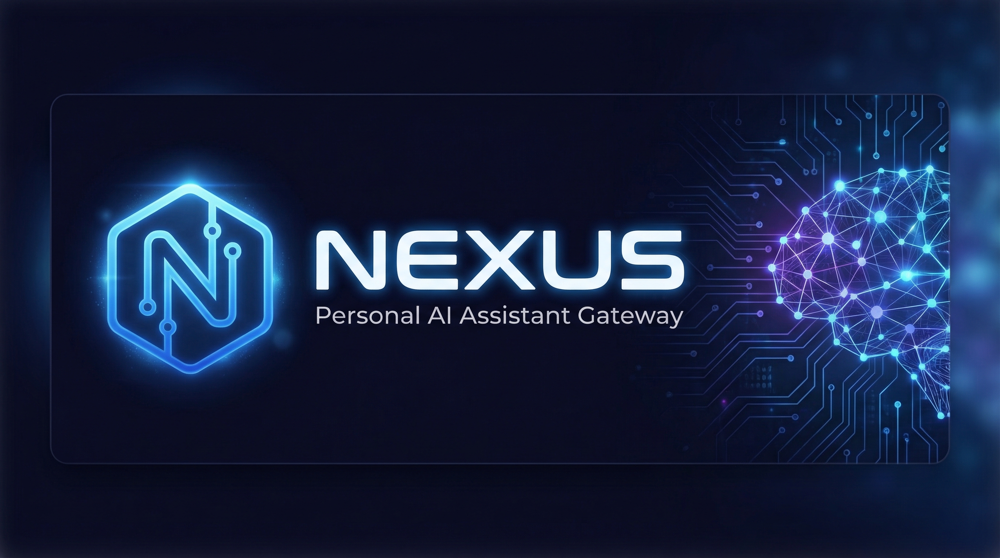

<p align="center">
  
</p>

<p align="center">
  <strong>Personal AI Assistant Gateway</strong>
</p>

<p align="center">
  
  <a href="LICENSE"></a>
  
  
</p>

---

## Features

- **Multi-provider AI** — Anthropic Claude and OpenAI GPT with a unified provider abstraction; swap or extend providers without touching business logic.
- **WebSocket gateway** — full-duplex RPC + server-push event stream; all messages are Zod-validated before processing.
- **Channel integrations** — Telegram and Discord adapters for receiving messages from external platforms.
- **Plugin marketplace** — install, update, and publish plugins through any HTTP registry with a single CLI command.
- **SolidJS UI** — built-in web interface served at `/ui/`; no separate front-end server needed.

---

## Quick Start

```bash
# 1. Install dependencies
npm install

# 2. Set your AI provider key
export ANTHROPIC_API_KEY=sk-ant-...        # or OPENAI_API_KEY=sk-...

# 3. Start the gateway
npx tsx packages/cli/src/index.ts gateway run

# 4. Open the web UI
open http://localhost:19200/ui/
```

---

## Architecture

```
┌─────────────────────────────────────────────────────────┐
│                        Clients                          │
│   Browser (SolidJS)  ·  CLI  ·  Telegram  ·  Discord   │
└───────────────┬─────────────────────────┬───────────────┘
                │ HTTP / WebSocket         │ Channel adapters
┌───────────────▼─────────────────────────▼───────────────┐
│                    @nexus/gateway                        │
│  Hono HTTP server  +  WebSocket RPC server               │
│  Auth middleware   +  RPC dispatch table                 │
└───────────────┬─────────────────────────────────────────┘
                │ @nexus/core  (SQLite WAL)
┌───────────────▼─────────────────────────────────────────┐
│                     @nexus/core                         │
│  Sessions  ·  Messages  ·  Config  ·  Agents  ·  Audit  │
│  Crypto    ·  Rate-limit  ·  Events bus                  │
└───────────────┬─────────────────────────────────────────┘
                │
┌───────────────▼─────────────────────────────────────────┐
│                     @nexus/agent                        │
│  Execution loop  ·  Context builder  ·  Tool executor   │
│  Providers: Anthropic, OpenAI        ·  Tools: bash, fs │
└─────────────────────────────────────────────────────────┘
                │
┌───────────────▼─────────────────────────────────────────┐
│              @nexus/plugins  +  extensions/*            │
│  Plugin loader  ·  Marketplace registry client           │
└─────────────────────────────────────────────────────────┘
```

---

## CLI Commands

| Command | Description |
|---|---|
| `nexus gateway run` | Start the gateway server |
| `nexus gateway stop` | Stop a running gateway |
| `nexus send <message>` | Send a message and print the response |
| `nexus status` | Show gateway status and connected clients |
| `nexus config get [section]` | Read config (sections: `gateway`, `agent`, `security`) |
| `nexus config set <section> <json>` | Write a config section |
| `nexus plugins list` | List installed plugins |
| `nexus plugins search <query>` | Search all registries |
| `nexus plugins install <id>` | Install a plugin |
| `nexus plugins update [id]` | Update one or all plugins |
| `nexus plugins uninstall <id>` | Remove a plugin |
| `nexus plugins info <id>` | Show plugin details |
| `nexus plugins registry list` | List configured registries |
| `nexus plugins registry add <url>` | Add a registry |
| `nexus plugins registry remove <url>` | Remove a registry |

Add `--json` to any command for machine-readable output.

---

## Configuration

Configuration is stored in a local SQLite database (`~/.nexus/nexus.db`) and managed through `nexus config set`.

| Section | Key | Type | Default | Description |
|---|---|---|---|---|
| `gateway` | `port` | number | `19200` | TCP port the server listens on |
| `gateway` | `bind` | `loopback\|lan\|all` | `loopback` | Network interface binding |
| `gateway` | `verbose` | boolean | `false` | Verbose request logging |
| `agent` | `defaultProvider` | string | `anthropic` | AI provider to use |
| `agent` | `defaultModel` | string | `claude-sonnet-4-6` | Model identifier |
| `agent` | `workspace` | string | — | Allowed filesystem workspace path |
| `agent` | `thinkLevel` | `off\|low\|medium\|high` | `low` | Extended thinking budget |
| `security` | `gatewayToken` | string | — | Bearer token for WebSocket auth |
| `security` | `gatewayPassword` | string | — | Password fallback for auth |
| `security` | `dmPolicy` | `pairing\|open\|deny` | `pairing` | DM channel policy |
| `security` | `promptGuard` | `enforce\|warn\|off` | `enforce` | Prompt injection guard |

Example:

```bash
nexus config set gateway '{"port": 19200, "bind": "loopback"}'
nexus config set agent '{"defaultProvider": "openai", "defaultModel": "gpt-4o"}'
nexus config set security '{"gatewayToken": "my-secret-token"}'
```

---

## Documentation

- [Architecture](docs/architecture.md)
- [API Reference](docs/api-reference.md)
- [Configuration](docs/configuration.md)
- [Channels (Telegram & Discord)](docs/channels.md)
- [Plugin Authoring](docs/plugins.md)
- [Deployment](docs/deployment.md)
- [Plugin Marketplace](MARKETPLACE.md)

---

## License

MIT — see [LICENSE](LICENSE).
